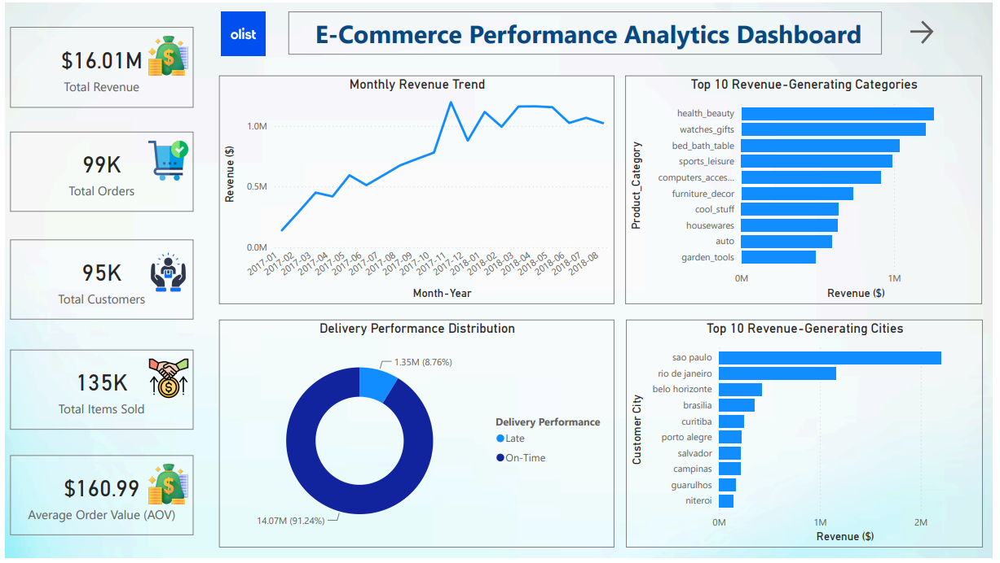
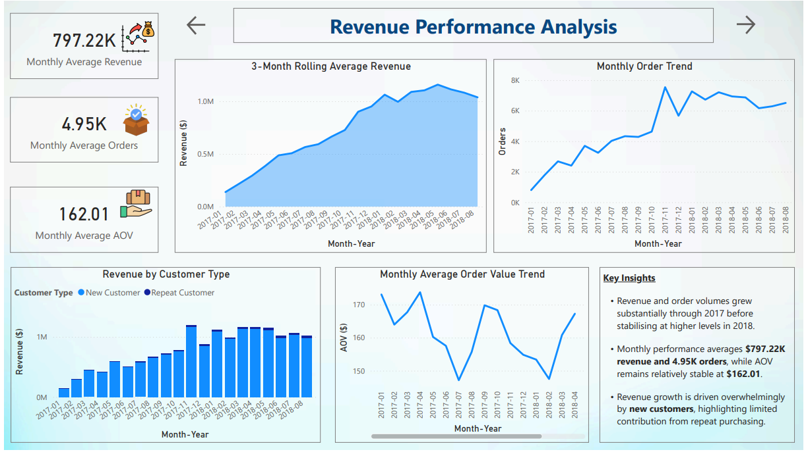
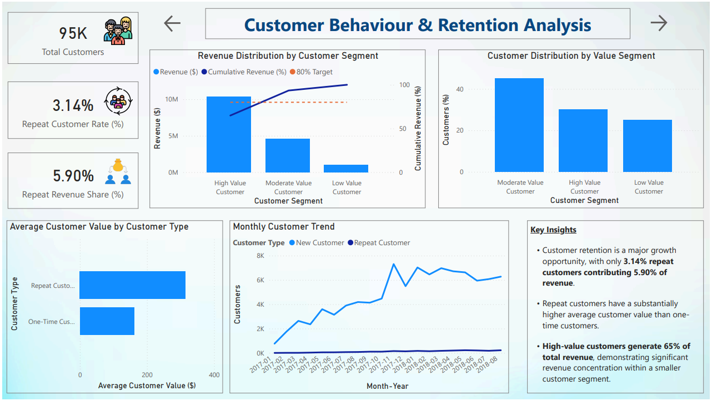
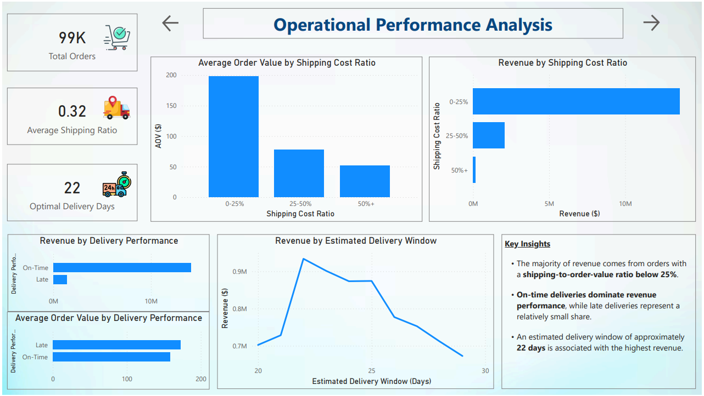
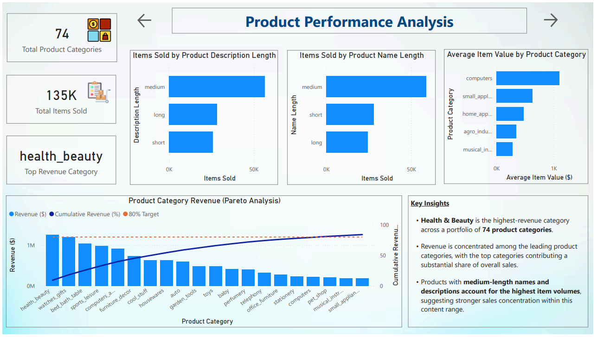
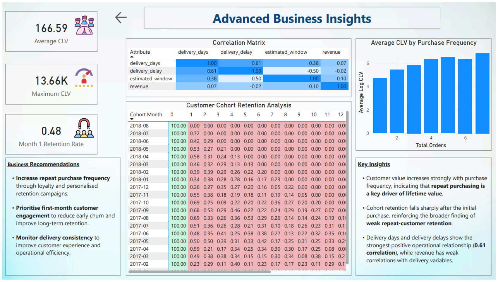

# E-Commerce Performance Analytics

## Project Overview

This project is an end-to-end analysis of the **Olist Brazilian E-Commerce dataset**, using **PostgreSQL, Python, and Power BI** to evaluate business performance across revenue, customers, products, and operations.

Raw transactional data was transformed into analysis-ready datasets using SQL, advanced customer and operational analyses were performed in Python, and the results were presented through a six-page Power BI dashboard.

The analysis covers approximately:

- **$16.01M Total Revenue**
- **99K Orders**
- **95K Customers**
- **135K Items Sold**
- **74 Product Categories**

The project moves beyond descriptive reporting by investigating the underlying drivers of business performance and identifying opportunities to improve **customer retention, customer value, product strategy, and operational efficiency**.

---

# Business Objectives

The project was designed around six specific business objectives.

## 1. Evaluate Revenue Growth and Performance

Analyse revenue, order volume, and Average Order Value over time to determine:

- How business performance changed across the analysed period
- Whether revenue growth was supported by increasing order volumes
- Whether Average Order Value changed materially over time
- Whether revenue growth was driven primarily by new or repeat customers

---

## 2. Assess Customer Retention and Repeat Purchasing

Measure customer purchasing behaviour to determine:

- What percentage of customers make repeat purchases
- How much revenue repeat customers contribute
- Whether repeat customers generate greater value than one-time customers
- How dependent the business is on continuous new-customer acquisition

---

## 3. Identify the Most Valuable Customer Segments

Analyse customer value and revenue concentration to determine:

- Which customer segments contribute the most revenue
- How concentrated revenue is among high-value customers
- How purchase frequency relates to Customer Lifetime Value
- Which customer groups should be prioritised for retention

---

## 4. Identify the Products Driving Commercial Performance

Evaluate product and category performance to determine:

- Which product categories generate the highest revenue
- How concentrated revenue is across the product portfolio
- Which categories have the highest average item values
- Whether product name and description characteristics are associated with item sales

---

## 5. Evaluate Operational and Delivery Performance

Analyse shipping and delivery characteristics to determine:

- How shipping costs compare with order value
- Which shipping-cost ratios account for the greatest revenue
- How on-time and late deliveries compare
- How estimated delivery windows relate to revenue
- Whether delivery variables show meaningful relationships with revenue

---

## 6. Analyse Customer Retention and Lifetime Value Over Time

Use advanced analytics to determine:

- How customer retention changes after the first purchase
- When the largest decline in retention occurs
- How Customer Lifetime Value changes with purchase frequency
- Where customer-retention initiatives could have the greatest business impact

---

# Tools & Technologies

| Technology | Purpose |
|---|---|
| **PostgreSQL** | Data transformation, validation, analytical tables, and reusable views |
| **SQL** | Revenue, customer, product, and operational analysis |
| **Python** | Cohort retention, Customer Lifetime Value, and correlation analysis |
| **Pandas** | Data manipulation and analytical processing |
| **Jupyter Notebook** | Advanced analytical workflows |
| **Power BI** | Dashboard development and business visualisation |
| **DAX** | KPI measures and dashboard calculations |

---

# Analytical Workflow

```text
Raw Olist E-Commerce Data
            │
            ▼
      PostgreSQL
            │
            ├── Data Validation
            ├── Analytical Base Tables
            ├── Order-Level Dataset
            ├── Item-Level Dataset
            └── Reusable SQL Views
            │
            ▼
     SQL Business Analysis
            │
            ├── Revenue Analysis
            ├── Customer Analysis
            ├── Product Analysis
            └── Operational Analysis
            │
            ▼
    Python Advanced Analytics
            │
            ├── Cohort Retention
            ├── Customer Lifetime Value
            └── Correlation Analysis
            │
            ▼
        Power BI
            │
            ▼
Six-Page Business Analytics Dashboard
            │
            ▼
Business Insights & Recommendations
```

---

# Data Preparation & Modelling

The raw transactional data was transformed into structured analytical datasets before visualisation.

Two primary analytical datasets were created at different levels of granularity.

## Order-Level Dataset

**Grain:** One row per order.

Used for:

- Revenue analysis
- Customer analysis
- Repeat purchasing
- Order trends
- Average Order Value
- Delivery performance

## Order-Item-Level Dataset

**Grain:** One row per order item.

Used for:

- Product analysis
- Product category performance
- Item pricing
- Freight analysis
- Shipping-cost ratios
- Product characteristics

Separating the analytical datasets by grain helps prevent incorrect aggregation when analysing order-level and item-level metrics.

---

# Power BI Dashboard

The final Power BI report contains six analytical pages, progressing from executive-level KPIs to deeper customer, product, operational, and advanced analytics.

---

## 1. Executive Overview



Provides a high-level summary of overall e-commerce performance.

### Key Metrics

- **$16.01M** Total Revenue
- **99K** Total Orders
- **95K** Total Customers
- **135K** Total Items Sold
- **$160.99** Average Order Value

### Analysis

- Monthly Revenue Trend
- Top 10 Revenue-Generating Categories
- Top 10 Revenue-Generating Cities
- Delivery Performance Distribution

---

## 2. Revenue Performance Analysis



Examines how revenue, orders, and Average Order Value changed over time.

### Key Metrics

- **$797.22K** Monthly Average Revenue
- **4.95K** Monthly Average Orders
- **$162.01** Monthly Average AOV

### Analysis

- 3-Month Rolling Average Revenue
- Monthly Order Trend
- Monthly Average Order Value Trend
- Revenue by Customer Type

The page helps distinguish between overall revenue growth, order-volume growth, changes in transaction value, and the contribution of new versus repeat customers.

---

## 3. Customer Behaviour & Retention Analysis



Examines customer retention, customer value, and revenue concentration.

### Key Metrics

- **95K** Total Customers
- **3.14%** Repeat Customer Rate
- **5.90%** Repeat Revenue Share

### Analysis

- Revenue Distribution by Customer Segment
- Customer Distribution by Value Segment
- Average Customer Value by Customer Type
- Monthly Customer Trends
- Customer Revenue Pareto Analysis

This analysis evaluates whether revenue is broadly distributed across customers or concentrated within smaller high-value segments.

---

## 4. Operational Performance Analysis



Evaluates the relationship between shipping economics, delivery performance, and commercial outcomes.

### Key Metrics

- **99K** Total Orders
- **0.32** Average Shipping Ratio
- **22 Days** Highest-Revenue Estimated Delivery Window

### Analysis

- Average Order Value by Shipping Cost Ratio
- Revenue by Shipping Cost Ratio
- Revenue by Delivery Performance
- Average Order Value by Delivery Performance
- Revenue by Estimated Delivery Window

This page helps identify how shipping costs and fulfilment characteristics vary across commercially important orders.

---

## 5. Product Performance Analysis



Identifies the categories and product characteristics associated with the strongest sales performance.

### Key Metrics

- **74** Product Categories
- **135K** Total Items Sold
- **Health & Beauty** Highest-Revenue Category

### Analysis

- Product Category Revenue Pareto Analysis
- Average Item Value by Product Category
- Items Sold by Product Description Length
- Items Sold by Product Name Length

Pareto analysis is used to evaluate how strongly revenue is concentrated among leading product categories.

---

## 6. Advanced Business Insights



Extends the descriptive analysis using customer retention, lifetime-value, and correlation techniques.

### Key Metrics

- **166.59** Average CLV
- **13.66K** Maximum CLV
- **0.48** Month 1 Retention Rate

### Analysis

- Customer Cohort Retention
- Customer Lifetime Value
- CLV by Purchase Frequency
- Operational Correlation Matrix

This page investigates customer behaviour beyond standard KPI reporting and identifies deeper patterns in repeat purchasing and operational performance.

---

# SQL Analysis

PostgreSQL was used as the primary data transformation and analytical processing layer.

```text
SQL/
│
├── 01_base_tables.sql
├── 02_validation.sql
├── 03_core_views.sql
├── 04_revenue_analysis.sql
├── 05_customer_analysis.sql
├── 06_product_analysis.sql
├── 07_operational_analysis.sql
└── run_all_views.sql
```

## SQL Techniques Demonstrated

- Common Table Expressions (CTEs)
- Window Functions
- Aggregate Functions
- CASE Statements
- Multi-Table Joins
- Reusable SQL Views
- Data Validation
- Rolling Averages
- Customer Segmentation
- Cumulative Revenue Analysis
- Pareto Analysis
- Revenue Trend Analysis
- Product Category Analysis
- Shipping Ratio Analysis
- Delivery Performance Analysis
- Percentile-Based Grouping

---

# Python Advanced Analytics

Python was used for analytical tasks that extended beyond standard SQL aggregation and dashboard calculations.

```text
Python/
│
├── 01_cohort_analysis.ipynb
├── 02_CLV_analysis.ipynb
└── 03_correlation_analysis.ipynb
```

## Cohort Retention Analysis

Customers were grouped according to their first purchase month and tracked across subsequent periods.

The analysis was designed to:

- Measure retention following customer acquisition
- Identify when repeat activity declines
- Compare retention patterns between cohorts
- Identify opportunities for targeted retention activity

---

## Customer Lifetime Value Analysis

Customer Lifetime Value was analysed alongside purchase frequency.

The analysis examines whether customers who make more purchases also generate greater long-term value and helps quantify the commercial importance of repeat purchasing.

---

## Correlation Analysis

Operational variables were analysed to identify relationships between:

- Delivery Days
- Delivery Delay
- Estimated Delivery Window
- Revenue

This provides additional context around whether operational performance variables move together and whether they have strong linear relationships with revenue.

---

# Repository Structure

```text
E-Commerce-Performance-Analytics/
│
├── README.md
│
├── Dashboard/
│   ├── ecommerce_dashboard.pbix
│   └── ecommerce_dashboard.pdf
│
├── Images/
│   ├── 01_Executive_Overview.png
│   ├── 02_Revenue_Analysis.png
│   ├── 03_Customer_Analytics.png
│   ├── 04_Operational_Analytics.png
│   ├── 05_Product_Analytics.png
│   └── 06_Advanced_Analytics.png
│
├── Python/
│   ├── 01_cohort_analysis.ipynb
│   ├── 02_CLV_analysis.ipynb
│   └── 03_correlation_analysis.ipynb
│
└── SQL/
    ├── 01_base_tables.sql
    ├── 02_validation.sql
    ├── 03_core_views.sql
    ├── 04_revenue_analysis.sql
    ├── 05_customer_analysis.sql
    ├── 06_product_analysis.sql
    ├── 07_operational_analysis.sql
    └── run_all_views.sql
```

---

# Dataset

This project uses the **Olist Brazilian E-Commerce Dataset**, containing anonymised marketplace data covering:

- Orders
- Customers
- Products
- Sellers
- Order Items
- Payments
- Product Categories
- Delivery Information
- Geographic Information

The raw data was transformed into analysis-ready datasets before being used for SQL, Python, and Power BI analysis.

---

# Key Insights & Business Recommendations

## 1. Customer Retention Is the Largest Identified Growth Opportunity

Only **3.14% of customers make repeat purchases**, and repeat customers contribute approximately **5.90% of total revenue**.

However, repeat customers have substantially higher average customer value than one-time customers.

### Recommendation

Increase repeat purchase frequency through:

- Personalised post-purchase campaigns
- Loyalty incentives
- Relevant product recommendations
- Re-engagement campaigns

Increasing the proportion of customers who make a second purchase could improve long-term customer value and reduce dependence on continuous customer acquisition.

---

## 2. High-Value Customers Drive a Disproportionate Share of Revenue

High-value customers generate approximately **65% of total revenue**, despite representing a smaller proportion of the customer base.

This demonstrates significant revenue concentration within a commercially important customer segment.

### Recommendation

Prioritise high-value customers for:

- Targeted retention campaigns
- Loyalty programmes
- Personalised offers
- Cross-selling opportunities

Protecting this segment could have a disproportionate impact on overall revenue retention.

---

## 3. Repeat Purchasing Is a Key Driver of Customer Lifetime Value

Customer value increases strongly as purchase frequency rises.

Customers placing more orders demonstrate substantially greater lifetime value than customers making only one purchase.

### Recommendation

Focus on moving customers from their **first purchase to their second purchase**, rather than relying primarily on new-customer acquisition.

This could be supported through targeted follow-up communication and personalised incentives immediately after the first transaction.

---

## 4. Customer Retention Declines Sharply After the Initial Purchase

Cohort analysis shows a substantial decline in customer activity following the first purchase.

This reinforces the low overall repeat-customer rate and identifies the early post-purchase period as a critical retention window.

### Recommendation

Prioritise **first-month customer engagement** through:

- Post-purchase communication
- Personalised recommendations
- Time-sensitive second-purchase incentives
- Re-engagement campaigns

The objective should be to reduce early customer churn and increase the probability of a second transaction.

---

## 5. Revenue Growth Is Predominantly Acquisition-Led

Revenue and order volumes grew substantially through 2017 before stabilising at higher levels in 2018.

However, the very low repeat-customer rate indicates that revenue remains heavily dependent on new customers.

### Recommendation

Balance acquisition spending with retention initiatives.

A stronger contribution from existing customers could create a more sustainable revenue base and reduce dependence on continuously acquiring new buyers.

---

## 6. Revenue Is Concentrated Among Leading Product Categories

**Health & Beauty** is the highest-revenue category across a portfolio of **74 product categories**.

Pareto analysis also shows that leading categories contribute a substantial proportion of overall revenue.

### Recommendation

Use category-level performance to support:

- Inventory prioritisation
- Marketing allocation
- Product assortment decisions
- Promotional planning

High-performing categories should be protected while lower-performing categories should be evaluated for growth potential or rationalisation.

---

## 7. Shipping Economics Are Strongest Among Lower Shipping-Cost Ratios

The majority of revenue comes from orders where shipping costs represent **less than 25% of order value**.

These orders also show substantially higher Average Order Values than orders with higher shipping-cost ratios.

### Recommendation

Monitor **shipping cost as a proportion of order value**, particularly for lower-value transactions.

Identifying orders where freight represents an unusually large share of transaction value could support better pricing, shipping, or fulfilment decisions.

---

## 8. Delivery Consistency Remains Operationally Important

On-time deliveries account for the overwhelming majority of analysed revenue.

Delivery days and delivery delays also show the strongest positive relationship in the operational correlation analysis, at approximately **0.61**.

Revenue itself shows relatively weak linear correlations with the analysed delivery variables.

### Recommendation

Continue monitoring delivery consistency and delays as customer-experience metrics rather than assuming a direct causal relationship with revenue.

Reducing unexpected delays can support a more reliable customer experience and may complement broader retention initiatives.

---

# Overall Conclusion

The analysis identifies **customer retention as the clearest strategic opportunity**.

The business generated substantial revenue and order growth, but only **3.14% of customers make repeat purchases**. At the same time, repeat customers demonstrate higher customer value, high-value customers contribute a disproportionate share of revenue, and Customer Lifetime Value increases with purchase frequency.

Together, these findings suggest that the business could strengthen long-term performance by shifting greater attention toward:

1. **Converting first-time buyers into repeat customers**
2. **Retaining and growing high-value customer segments**
3. **Prioritising early post-purchase engagement**
4. **Optimising commercially important product categories**
5. **Maintaining efficient shipping economics and consistent delivery performance**

The project demonstrates how **SQL, Python, and Power BI** can be combined to transform raw transactional data into structured analysis, business insights, and actionable recommendations.
